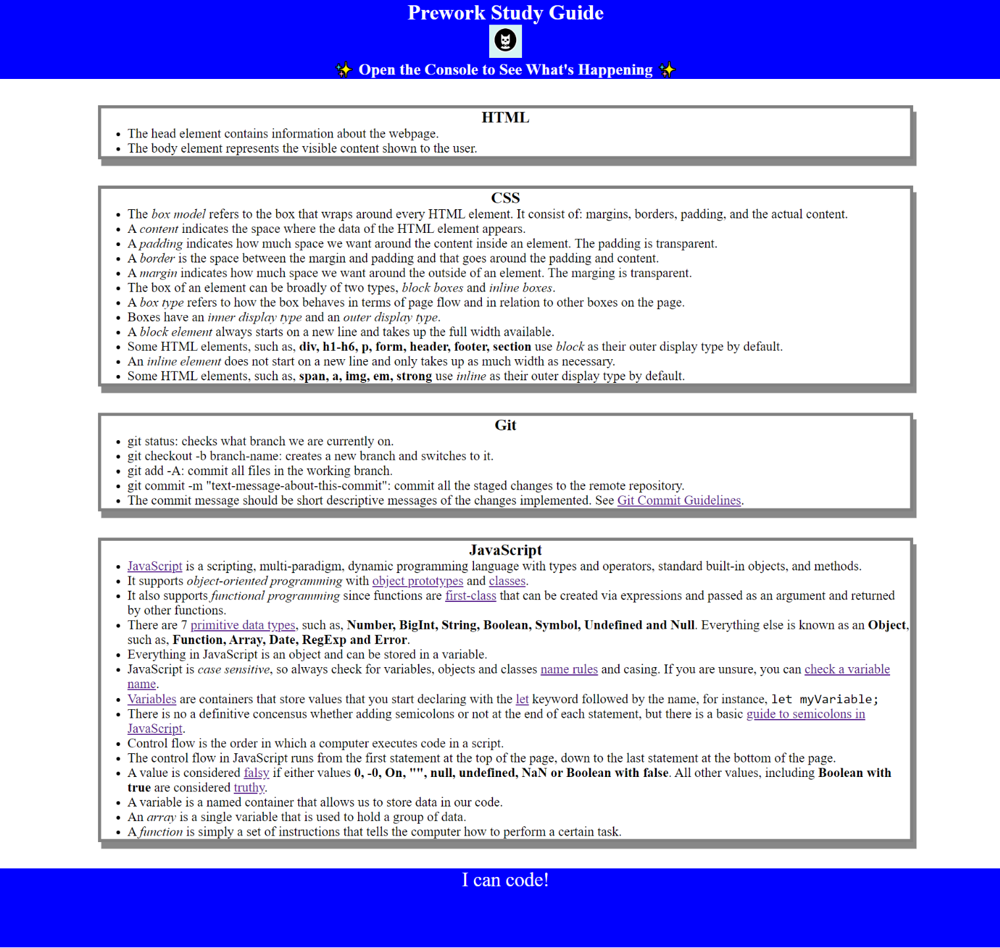
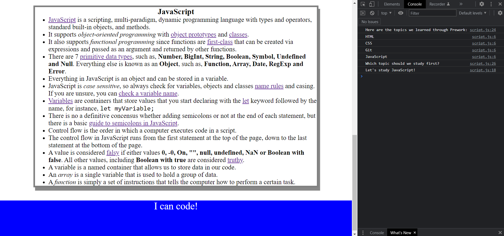

# Prework Study Guide Webpage

## Description

This Study Guide is my prework final project that I did for the **Front-End Developer Bootcamp** run by [Trilogy Education](https://en.wikipedia.org/wiki/Trilogy_Education_Services).

The project contains my initial notes on HTML, CSS, Git and JavaScript, which are some of topics that we will be looking during this boot camp.

During the following weeks I will be adding additional notes and improvements to the page that will be available via Github Pages.

I hope you find helpful my notes, enjoy the experience, and by the end of the course we all become new skilled professional as a front-end developers.

Happy coding :-)

## Table of Contents

If your README is long, add a table of contents to make it easy for users to find what they need.

- [Prework Study Guide Webpage](#prework-study-guide-webpage)
  - [Description](#description)
  - [Table of Contents](#table-of-contents)
  - [Installation](#installation)
  - [Usage](#usage)
  - [Credits](#credits)
  - [License](#license)
  - [Badges](#badges)

## Installation

In order to this project, you need clone this repository and open the `index.html` file in any browser.

## Usage

Once you have opened the `index.html` in your preferred browser, you should see a page that looks like as the image below:

Then open the console, which you can see in the inpector or developer tools of your browser, and reload the page to see the output of the Javascript code running in the console.  It will list the topics we learned from prework and choose one topic for us to study first.

The suggestion of the topic to learn will be selected randomly, and should change as you refresh the page many times. 

## Credits

This project has been an individual project so no more collaborators apart from myself has been involved in the development and release of this code.

## License

This project is released with a MIT license. For more information, please check the LICENSE file.

## Badges

